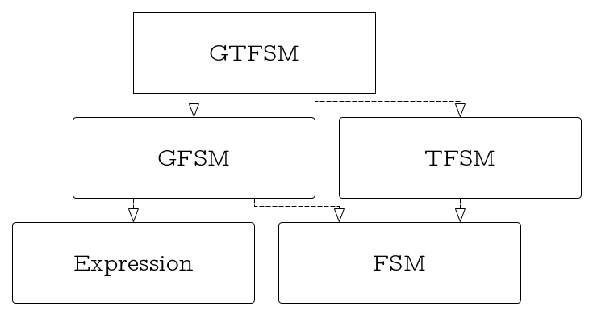

# FSM familly with ecore

## Implementations

| #    | Implementation details                   | FSM                                      | TFSM                                     |
| ---- | ---------------------------------------- | ---------------------------------------- | ---------------------------------------- |
| 1    | Classes as parameter - Arbitrary abstract type | [fr.inria.diverse.fsm.algebra](fr.inria.diverse.fsm.algebra) | [fr.inria.diverse.tfsm.algebra](fr.inria.diverse.tfsm.algebra) |
| 2    | Attributes as parameters - One abstract type by ecore class | [fr.inria.diverse.fsm.algebra2](fr.inria.diverse.fsm.algebra2) | [fr.inria.diverse.tfsm.algebra2](fr.inria.diverse.tfsm.algebra2) |
| 3    | Classes as parameter - One abstract type by Class with no custom supertype [1] | [fr.inria.diverse.fsm.algebra3](fr.inria.diverse.fsm.algebra3) | [fr.inria.diverse.tfsm.algebra3](fr.inria.diverse.tfsm.algebra3) |
| 4    | Attributes as parameters - One abstract type by Class with no custom supertype [1] | [fr.inria.diverse.fsm.algebra4](fr.inria.diverse.fsm.algebra4) | [fr.inria.diverse.tfsm.algebra4](fr.inria.diverse.tfsm.algebra4) |

[1]: In other terms, only classes which inherits directly from EObject emits a new abstract type and all its children have the same return type in the algebra.

### Implementation choice

For the rest of the experiments we are going to use the #3 implementation which offer the best tradeoff between type safety and code maintainability.

# Language family

| inherit from   | TFSM | GFSM | GTFSM        |
| -------------- | ---- | ---- | ------------ |
| **Expression** |      | yes  | transitively |
| **FSM**        | yes  | yes  | transitively |
| **TFSM**       |      |      | yes          |
| **GFSM**       |      |      | yes          |

# Expression

## Concepts

* Integer

  * Sum
  * Mult
  * Neg
  * VarRef
  * Const

* Boolean

  * And
  * Or
  * Not
  * Greater Than (between two ints)
  * Equals (between two ints)

## FSM

### Concepts

- State
- Transition
- transition triggered on string events

## TFSM

### Concepts

- State
- Transition
- Clock (tick + reset on transition trigger)
- Transition triggered when event called + clock constraints ok

# GFSM

## Concepts

- Guarded FSM
  - Context changed by expressions execution on enter/leave of a state
  - Transition guarded by boolean expression with access to the context

## Notes
-  Java 8 cannot have private default method. By convention "private" method are public with a name prefixed with `_`.

# Observations
*   Reopening a class in a extended model is currently not an easy task
*   ... and it's even worse when the extended class already has sub-classes in the original model
    * Reusing the existing code is not always efficient (cf Graphviz impls)
    * no explicit definition of the type returned by a subpart of the model (e.g. the ClockConstraints in TFSM can be defined as another algebra which returns booleans).

# TODO
* Removing the setFinal mess which should be an implemenation detail
* GFSM:
    * Replacing class by interface for the OA implementations -> easier reuse.
    * Every state must be passed as parameter and/or directly stored in the model.
* Idea for slicing: Generating a limited interface according to the selected classes and delegating to the original model's OA methods.
    * Trying to deal with generic types in ecore models (for BooleanOperations for example).
